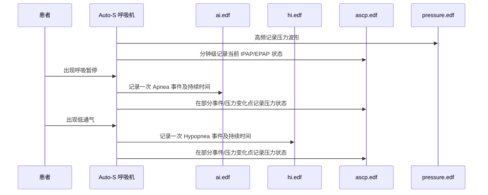

# AI / HI / ASCP 深度解析

## 一句话结论

| 文件 | 含义 | 数据里应如何使用 |
|------|------|------------------|
| `ai.edf` | Apnea event，呼吸暂停事件 | 每条记录代表一次 AI 事件；`value2` 很可能是持续秒数 |
| `hi.edf` | Hypopnea event，低通气事件 | 每条记录代表一次 HI 事件；`value2` 很可能是持续秒数 |
| `ascp.edf` | Auto-S 模式下的自动压力状态记录，推测为 IPAP/EPAP 压力对 | 不应当算作呼吸事件；适合画压力状态、压力调节或事件前后压力响应；两者差值对应设备设置的压力支撑 PS |

需要特别注意：医学上的 AI/HI 通常是“每小时指数”，但这些 EDF 文件里的 `ai` / `hi` 是事件明细。要得到 AHI，应使用：

```text
AHI = (AI 事件数 + HI 事件数) / 有效使用小时数
```

这里的 AHI 是治疗过程中的设备记录结果，不能直接等同于未治疗状态下的诊断 AHI。

---

## 0. 时间戳解析修正

这些 16-byte 记录的后 8 字节是二进制时间戳：

```text
year(2 bytes LE), month, day, weekday/day-code, hour, minute, second
```

例如 `20260427_ai.edf` 第一条事件的时间戳字节是：

```text
ea 07 04 1b 01 00 37 3b
```

正确读取为：

```text
2026-04-27 00:55:59
```

不是：

```text
2026-04-27 01:00:55.59
```

其中第 5 个字节更像 weekday/day-code，不是 hour；最后一个字节是 second，不是百分之一秒。这个修正会显著影响夜间时长、结束时间和 AHI 计算。

---

## 1. AI - Apnea / 呼吸暂停事件

### 医学语义

Apnea 通常指呼吸气流停止或接近停止，并持续至少 10 秒。不同设备可能会进一步区分阻塞性、中枢性或混合性呼吸暂停；当前文件里没有足够证据可靠地区分这些子类型。

### 数据结构

每条记录 16 字节：

```text
value1:    Uint32LE
value2:    Uint32LE
timestamp: 8-byte binary timestamp
```

### 当前数据观察

以 `20260427_ai.edf` 为例：

| 字段 | 观察值 | 更稳妥的解读 |
|------|--------|--------------|
| `value1` | 始终为 `1` | 事件标记或事件计数；不能仅凭当前数据断定为 OA |
| `value2` | `10` 到 `43` | 很可能是该次呼吸暂停的持续秒数 |
| `timestamp` | 真实钟表时间 | 事件发生或事件结束的时刻；更可能是设备写入该事件的时间点 |

样例：

```text
#  value1  value2(s)  timestamp
1       1        21   2026-04-27 00:55:59
2       1        15   2026-04-27 01:24:56
3       1        20   2026-04-27 01:29:59
4       1        15   2026-04-27 01:37:35
```

`value2` 全部大于等于 10 秒，这与 Apnea 事件的最短持续时间规则一致，因此“`value2` 是持续秒数”的可信度较高。

---

## 2. HI - Hypopnea / 低通气事件

### 医学语义

Hypopnea 通常指气流显著减少，并持续至少 10 秒。临床定义还常结合血氧下降或微觉醒，但当前呼吸机文件没有提供血氧或脑电觉醒数据，所以这里只能按设备事件记录理解。

### 当前数据观察

以 `20260427_hi.edf` 为例：

| 字段 | 观察值 | 更稳妥的解读 |
|------|--------|--------------|
| `value1` | 始终为 `1` | 事件标记或事件计数 |
| `value2` | `10`, `12`, `13` | 很可能是低通气持续秒数 |
| `timestamp` | 真实钟表时间 | 事件发生或事件结束的时刻 |

样例：

```text
#  value1  value2(s)  timestamp
1       1        13   2026-04-27 05:00:29
2       1        12   2026-04-27 06:21:06
3       1        10   2026-04-27 07:10:04
```

`hi` 与 `ai` 使用相同的 16-byte 结构，并且 `value2` 同样全部大于等于 10 秒，因此它们很可能是一组同类事件表。

---

## 3. AI / HI / AHI 的正确关系

`AI + HI = AHI` 这个说法只在“指数”层面成立，不能直接把事件数相加后称为 AHI。

当前 EDF 文件里：

```text
AI count = ai.edf 事件条数
HI count = hi.edf 事件条数
AHI      = (AI count + HI count) / 使用小时数
```

按 `usetime.edf` 修正后的有效使用时长粗算：

| 日期 | 使用时长 | AI 事件数 | HI 事件数 | 估算 AHI |
|------|----------|-----------|-----------|----------|
| 2026-04-27 | 6.668 h | 39 | 3 | 6.30 /h |
| 2026-04-28 | 7.115 h | 35 | 6 | 5.76 /h |
| 2026-04-29 | 6.294 h | 28 | 8 | 5.72 /h |

因此，不能把 2026-04-27 的 `39 + 3 = 42` 直接解释成 AHI 42/h，也不能据此直接下“重度”的结论。更稳妥的表述是：设备在治疗过程中记录到约 5.7 到 6.3 次/小时的残余 AI/HI 事件。

---

## 4. ASCP - Auto-S 模式下的压力状态记录

你使用的是 Auto-S 模式，所以这里不应写成 ASV，也不应把 ASCP 直接展开为 Auto-Servo Controlled Pressure。当前没有厂商协议或说明书证明 `ASCP` 的官方全称。

从数据行为看，`ascp.edf` 的功能含义很明确：它不是呼吸事件列表，而是自动压力状态记录。

### 数据结构

同样是 16-byte 记录，但字段含义与 `ai` / `hi` 不同：

```text
value1:    推测为 IPAP x 10
value2:    推测为 EPAP x 10
timestamp: 8-byte binary timestamp
```

### 当前数据观察

| 日期 | ASCP 记录数 | `value1` 范围 | `value2` 范围 | `value1 - value2` |
|------|-------------|---------------|---------------|-------------------|
| 2026-04-27 | 401 | 131-150 | 91-110 | 始终为 40，即 PS=4.0 cmH2O |
| 2026-04-28 | 384 | 132-150 | 92-110 | 始终为 40，即 PS=4.0 cmH2O |
| 2026-04-29 | 301 | 134-150 | 94-110 | 始终为 40，即 PS=4.0 cmH2O |

把数值除以 10 后，正好落在呼吸机治疗压力的常见量级：

```text
value1 = 150 -> 15.0 cmH2O
value2 = 110 -> 11.0 cmH2O
差值 = 4.0 cmH2O
```

你在呼吸机设置中将压力支撑设为 4，因此 `value1 - value2 = 40` 不只是数据上的巧合，而是与 Auto-S 设置项中的 PS=4.0 cmH2O 对应。这也进一步支持 `value1/value2` 是一组双水平压力值，而不是两类独立事件计数。

因此更合理的解释是：

```text
value1 ~= IPAP x 10
value2 ~= EPAP x 10
PS     =  IPAP - EPAP = 4.0 cmH2O  # 与设备压力支撑设置一致
```

这里的 `IPAP/EPAP` 表述也符合 Auto-S 作为自动双水平 S 模式的语境。

### 与压力波形的交叉验证

`20260429_ascp.edf` 的几条记录与 `pressure.edf` 的近邻波形高度一致：

```text
2026-04-29 03:56:24  ASCP=13.9/9.9   pressure window ~= 9.0-14.0
2026-04-29 03:56:52  ASCP=14.6/10.6  pressure window ~= 9.9-14.7
2026-04-29 03:57:13  ASCP=15.0/11.0  pressure window ~= 10.6-15.1
2026-04-29 03:58:13  ASCP=15.0/11.0  pressure window ~= 11.0-15.1
```

这比“ASCP 是一种事件”更能解释它的数值范围、记录数量和与压力波形的对应关系。

### 采样间隔

ASCP 不是每秒记录一次。当前三天的数据中，大多数相邻 ASCP 记录相隔约 60 秒，同时在部分事件点或压力变化点附近会出现额外记录。

```text
2026-04-27: 400 个间隔中，349 个约为 55-65 秒
2026-04-28: 383 个间隔中，335 个约为 55-65 秒
2026-04-29: 300 个间隔中，271 个约为 55-65 秒
```

所以更准确的说法是：ASCP 像是“分钟级压力状态采样 + 事件/变化点补充记录”，而不是实时高频压力波形。真正的高频压力波形应看 `pressure.edf` 或 `real_pres.edf`，它们的采样间隔是 80 ms，即 12.5 Hz。

---

## 5. 三者的协作关系



这三个文件不应该在 UI 上放进同一种“事件计数”逻辑：

| 文件 | 推荐 UI 分类 |
|------|--------------|
| `ai.edf` | 呼吸事件 |
| `hi.edf` | 呼吸事件 |
| `ascp.edf` | 压力状态 / Auto-S 压力调节 |

---

## 6. value1 / value2 字段含义汇总

| 文件 | `value1` | `value2` | 可信度 |
|------|----------|----------|--------|
| `ai.edf` | 事件标记或计数，当前始终为 1 | 呼吸暂停持续秒数 | 高 |
| `hi.edf` | 事件标记或计数，当前始终为 1 | 低通气持续秒数 | 高 |
| `ascp.edf` | IPAP x 10，单位推测为 cmH2O | EPAP x 10，单位推测为 cmH2O；`value1 - value2` 对应设置的 PS=4 | 中高 |

仍需厂商文档确认的点：

- `AI` 事件是否区分 OA / CA / MA 等子类型。
- `AI` / `HI` 的 timestamp 表示事件开始时间、结束时间，还是设备写入时间。
- `ASCP` 的官方缩写全称。
- Auto-S 算法如何决定压力上升、维持和回落。
- `ASCP` 中 `value1` 是否一定是 IPAP、`value2` 是否一定是 EPAP；但两者差值对应压力支撑 PS 已由当前设备设置交叉确认。

在没有厂商协议前，最稳妥的工程解释是：

```text
ai/hi = 治疗过程中的呼吸事件明细
ascp  = Auto-S 治疗压力状态记录
AHI   = (ai 事件数 + hi 事件数) / usetime 小时数
```
