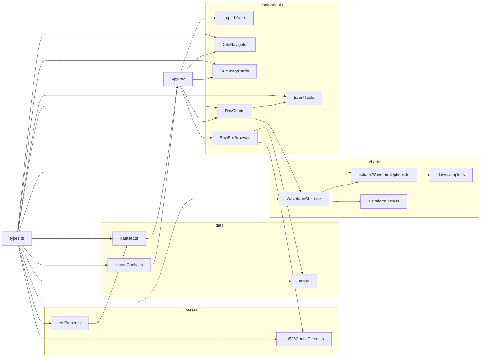
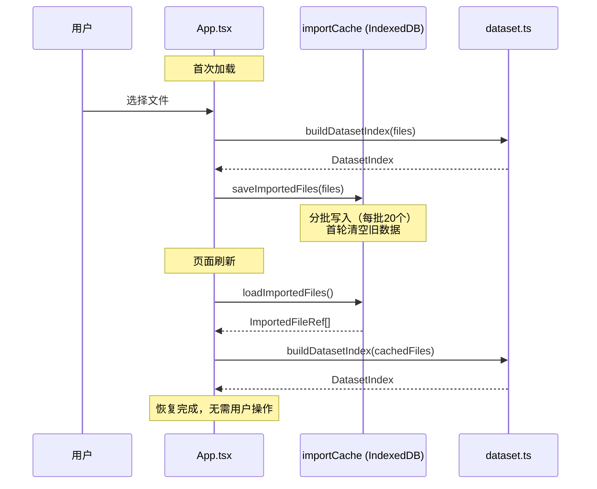
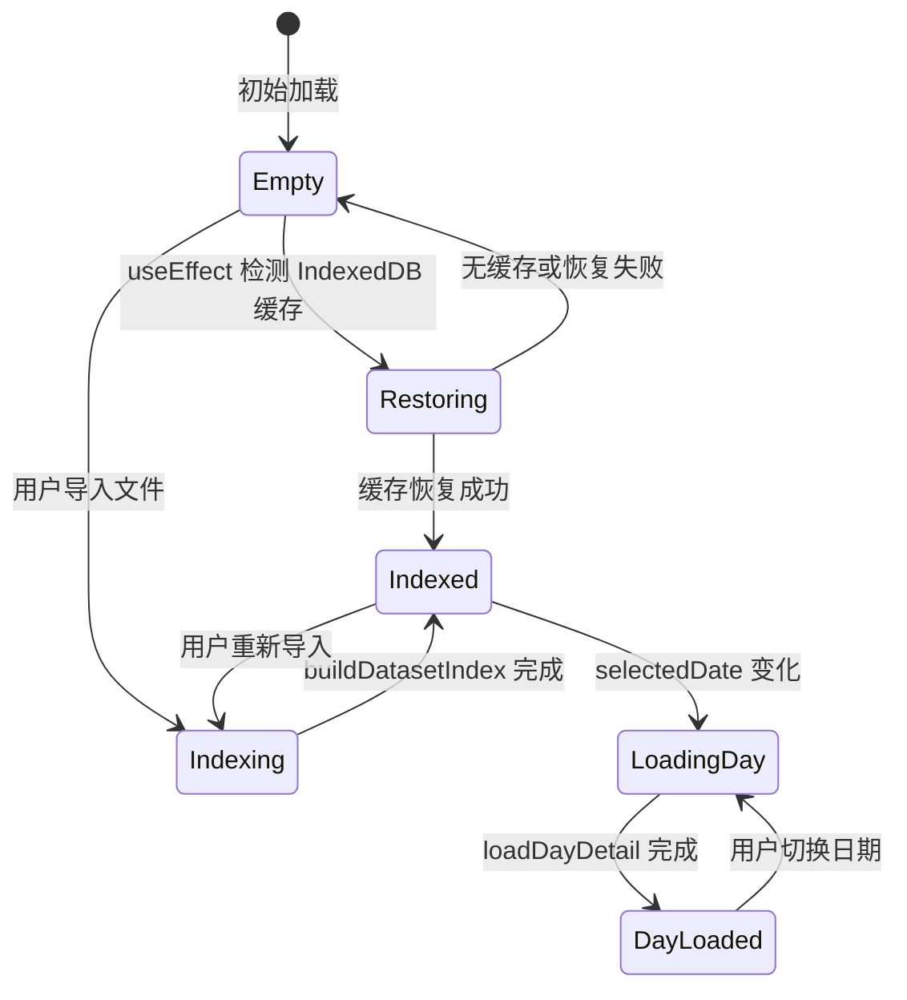

# 系统架构文档

## 1. 系统架构总览

本项目是一个纯浏览器端的呼吸机（乐普 BA525 CPAP）数据可视化工具。所有文件解析、数据处理和渲染均在客户端完成，原始数据不会上传到任何服务器。

```mermaid
graph TB
    subgraph 用户交互
        User[用户] --> ImportPanel[ImportPanel<br/>文件导入]
        User --> DateNavigator[DateNavigator<br/>日期导航]
        User --> DayCharts[DayCharts<br/>图表交互]
    end

    subgraph 状态管理 - App.tsx
        DatasetState[(dataset<br/>DatasetIndex)]
        SelectedDate[(selectedDate)]
        DayDetailState[(dayDetail)]
        ImportPanel -->|handleImport| DatasetState
        DatasetState --> SelectedDate
        SelectedDate -->|loadDayDetail| DayDetailState
    end

    subgraph 数据层
        ImportCache[importCache.ts<br/>IndexedDB 持久化]
        Dataset[dataset.ts<br/>索引构建与详情加载]
        EdfParser[edfParser.ts<br/>EDF 二进制解析]
        Ba525Parser[ba525ConfigParser.ts<br/>BA525 配置解析]
        CsvExport[csv.ts<br/>CSV 导出]
    end

    subgraph 图表层
        Downsample[downsample.ts<br/>降采样]
        EchartsOpts[echartsWaveformOptions.ts<br/>图表配置]
        WaveformData[waveformData.ts<br/>类型定义]
        WaveformChart[WaveformChart.tsx<br/>ECharts 渲染]
    end

    subgraph 展示层
        SummaryCards[SummaryCards<br/>摘要卡片]
        RawFileBrowser[RawFileBrowser<br/>原始文件浏览]
        EventTable[EventTable<br/>事件表格]
    end

    ImportPanel -->|ImportedFileRef[]| ImportCache
    ImportCache -->|启动恢复| Dataset
    Dataset --> EdfParser
    Dataset --> Ba525Parser
    EdfParser -->|ParsedVentilatorFile| Dataset
    Ba525Parser --> RawFileBrowser

    DatasetState --> DateNavigator
    DatasetState --> SummaryCards
    DayDetailState --> DayCharts
    DayDetailState --> RawFileBrowser

    DayCharts --> WaveformChart
    WaveformChart --> EchartsOpts
    EchartsOpts --> Downsample
    WaveformChart --> EventTable
    RawFileBrowser --> CsvExport
```

## 2. 完整数据流

### 2.1 导入流程

```
用户选择 DATAFILE 文件夹或多个 EDF 文件
  │
  ▼
ImportPanel 将 File 对象转为 ImportedFileRef[]（含 name、path、file）
  │
  ▼
App.handleImport() 调用 buildDatasetIndex(files, setIndexProgress)
  │
  ▼
┌─────────────────────────────────────────────────────────┐
│ buildDatasetIndex                                        │
│  1. inferDateFromPath() 从文件路径提取日期               │
│  2. 按日期分组为 filesByDay: Record<string, FileRef[]>  │
│  3. 并行调用 summarizeDay() 构建每天摘要                 │
│     - parseVentilatorFile() 解析每个文件                 │
│     - 提取信号存在、采样计数、事件计数                    │
│     - 从 usetime 事件推导使用会话（UseSession[]）        │
│     - 跳过压力扫描（延迟到 loadDayDetail 按需计算）      │
│  4. 返回 DatasetIndex                                    │
└─────────────────────────────────────────────────────────┘
  │
  ▼
saveImportedFiles() 将文件数据写入 IndexedDB
  │
  ▼
App 设置 dataset 状态，自动选择最近一天
```

### 2.2 日期选择与详情加载

```
用户选择日期（DateNavigator 导航 / 自动选择）
  │
  ▼
useEffect 监听 dataset + selectedDate 变化
  │
  ▼
loadDayDetail(dataset, selectedDate)
  │
  ├─ 优先使用 index.parsedFilesByDay 中已缓存的解析结果
  ├─ 若无缓存则重新解析该天文件
  ├─ 筛选信号文件（isSignal）
  ├─ 构建事件列表（isEventRecord），添加 secondsFromDayStart
  ├─ 按需计算压力范围（遍历 pressure 信号值）
  └─ 返回 DayDetail
  │
  ▼
App 设置 dayDetail 状态，触发子组件渲染
```

### 2.3 波形渲染流程

```
DayCharts 获取 detail 中的信号列表
  │
  ▼
用户通过 Tab 切换信号（flow/pressure/real_pres/real_flow/difleak）
  │
  ▼
WaveformChart 接收当前信号的 values + eventMarkers
  │
  ▼
buildEChartsWaveformOption():
  ├─ buildEChartsWaveformSeries() 将采样数据转为坐标点
  │   ├─ 优先使用 useSessions 映射到真实时间轴
  │   ├─ 降级使用 header.startTime
  │   └─ 最终降级使用采样索引或秒数
  ├─ buildTimestampMarkLineData() 在真实时间轴上标记事件
  └─ 返回 ECharts option
  │
  ▼
ECharts 渲染到 Canvas（ResizeObserver 自适应容器宽度）
```

### 2.4 页面刷新恢复

```
App 初始化时 useEffect → restoreImport()
  │
  ▼
loadImportedFiles() 从 IndexedDB 读取缓存文件
  │
  ▼
若有缓存 → buildDatasetIndex() → 恢复 dataset 状态
若无缓存 → 显示空状态引导用户导入
```

## 3. 各模块职责与依赖关系

### 3.1 类型系统（`src/types.ts`）

定义所有核心数据结构，无运行时代码，无依赖：

| 类型 | 职责 |
|------|------|
| `VentilatorHeader` | 512 字节 EDF 头部解析结果 |
| `ParsedVentilatorFile` | 单文件完整解析结果（header + payload + records） |
| `EventRecord` | 事件记录（AI/HI/ASCP/UseTime） |
| `UseSession` | 使用会话（startTime + endTime + durationSeconds） |
| `ImportedFileRef` | 用户导入文件的引用 |
| `DatasetIndex` | 全量数据索引（按日期组织） |
| `DaySummary` | 单日摘要（时长、事件统计、信号存在性） |
| `DayDetail` | 单日完整详情 |
| `DateFilter` | 日期筛选条件 |

### 3.2 解析层（`src/parser/`）

**`edfParser.ts`** — EDF 二进制解析器
- 输入：文件名 + `Uint8Array` 原始数据
- 输出：`ParsedVentilatorFile`
- 根据 header 中 offset 256 处的 `label` 字段决定 payload 解码方式
- 支持 8 种解析类型：`waveform_u8`、`waveform_u16le`、`waveform_i16le`、`events16`、`triples_u16le`、`raw_config`、`raw`、`invalid`
- 无外部依赖，纯 `DataView` 操作

文件格式对照表：

| Label（offset 256） | 解析类型 | Payload 编码 |
|---|---|---|
| `flow`、`difleak` | `waveform_u8` | 原始字节 |
| `pressure`、`real_pres` | `waveform_u16le` | uint16 LE 对 |
| `real_flow` | `waveform_i16le` | int16 LE 对 |
| `ai`、`hi`、`ascp`、`usetime` | `events16` | 16 字节记录（value1 u32 + value2 u32 + 8 字节时间戳） |
| `mvtvbr` | `triples_u16le` | 6 字节记录（3 × uint16 LE） |
| `config` | `raw_config` | BA525 配置 payload |

**`ba525ConfigParser.ts`** — BA525 设备配置解析器
- 输入：config 类型文件的 payload
- 输出：`Ba525Config`（字段列表 + byName 查找表）
- 每个 `FieldSpec` 记录了逆向工程状态：`confirmed`（UI 确认）、`diff-verified`（跨版本差异验证）、`inferred`（推断）、`unknown`（未知）、`reserved`（保留）
- 支持 192 字节配置记录 + 8 字节时间戳的连续解析
- `summarizeLocked()` 提取已确认字段供 UI 展示

### 3.3 数据层（`src/data/`）

**`dataset.ts`** — 数据索引构建与查询
- `buildDatasetIndex()`：并行构建每日摘要，返回 `DatasetIndex`
- `loadDayDetail()`：加载某天的完整详情，复用已解析的缓存数据
- `filterDays()`：按日期范围、事件类型、缺失文件筛选
- `inferDateFromPath()`：从文件路径提取日期（支持 `YYYYMMDD` 和 `YYYY-MM-DD` 格式）
- `buildUseSessions()`：从 `usetime` 事件记录推导使用会话

**`importCache.ts`** — IndexedDB 文件持久化
- 数据库名：`ventilator-web-visualizer-import-cache`
- 对象仓库：`files`（以 `path` 为主键）
- 提供 `saveImportedFiles()` 和 `loadImportedFiles()` 两个接口
- 写入时分批处理（每批 20 个文件），首轮清空旧数据

**`csv.ts`** — 数据导出
- `exportWaveformCsv()`：波形数据导出（含 index、seconds、value 列）
- `exportEventsCsv()`：事件记录导出
- `downloadCsv()`：通过 Blob URL 触发浏览器下载

### 3.4 图表层（`src/charts/`）

**`downsample.ts`** — Min-Max 降采样算法
- 输入：采样数据数组 + 可视范围 + 像素宽度
- 将数据按像素分桶，每桶保留最小值和最大值
- 保留原始索引，确保降采样后波形仍可精确定位

**`echartsWaveformOptions.ts`** — ECharts 配置构建
- `buildEChartsWaveformOption()`：生成完整的 ECharts option
- `buildEChartsWaveformSeries()`：将波形数据映射为坐标点
- 时间轴策略：useSessions 真实时间 → header.startTime → 采样索引降级
- 事件标记：支持时间戳模式（`buildTimestampMarkLineData`）和秒数偏移模式（`buildEventMarkLineData`）

**`WaveformChart.tsx`** — ECharts React 组件
- 按需注册 ECharts 模块（LineChart、DataZoom、MarkLine 等）
- ResizeObserver 自适应容器尺寸
- 支持事件聚焦（点击事件行自动缩放到对应时间范围）

**`waveformData.ts`** — 类型别名 `WaveformValues`

### 3.5 组件层（`src/components/`）

| 组件 | 职责 |
|------|------|
| `ImportPanel` | 文件夹/文件选择，触发导入流程 |
| `DateNavigator` | 日期导航（前后翻页、跳转、热力图、缺失筛选） |
| `SummaryCards` | 展示使用时长、AI/HI 计数、压力范围、缺失文件数 |
| `DayCharts` | 信号 Tab 切换 + 波形图 + 事件表格，懒加载 |
| `EventTable` | 事件列表（按类型筛选，点击定位到图表时间点） |
| `RawFileBrowser` | 原始文件浏览（header/payload 预览 + 配置解析 + CSV 导出） |

### 3.6 依赖关系图



## 4. importCache 设计动机与工作方式

### 设计动机

呼吸机的 DATAFILE 文件夹通常包含数天到数十天的数据，总文件体积可达数十 MB。用户每次刷新页面都需要重新选择文件夹才能查看数据，体验极差。由于项目承诺「不上传原始数据」，所有数据必须在浏览器本地存储，因此选择 IndexedDB 作为持久化方案：

- **localStorage** 有 5-10 MB 限制，不适合存储二进制文件数据
- **IndexedDB** 支持大容量结构化存储，适合存储 `ArrayBuffer` 形式的文件内容
- **Cache API** 设计用于 HTTP 缓存，不适合此场景的结构化查询需求

### 工作方式



**存储结构：**
- 数据库名：`ventilator-web-visualizer-import-cache`，版本 1
- 对象仓库：`files`，主键为文件 `path`
- 每条记录包含：`path`、`name`、`type`、`lastModified`、`data`（ArrayBuffer）

**写入策略：**
- 首批写入时执行 `store.clear()` 清空旧数据，确保新旧数据不会混合
- 分批写入（每批 20 个），避免单次事务过大
- 每批使用独立的 `readwrite` 事务

**读取策略：**
- App 初始化时（`useEffect([], [])`）异步加载
- 如果 IndexedDB 不可用（SSR 环境）直接返回空数组
- 加载完成后调用 `buildDatasetIndex` 重建索引

**降级处理：**
- 如果 IndexedDB 写入失败，显示提示「已导入，但浏览器无法缓存这些文件；刷新后需要重新选择」
- 如果恢复失败，显示「无法恢复上次导入的文件，请重新选择 DATAFILE 文件夹」

## 5. 降采样策略与触发条件

### 问题背景

呼吸机波形数据采样率通常为 50-100 Hz，一天的数据量可达数百万采样点。直接渲染所有数据点会导致：
- DOM/Canvas 绘制开销巨大，页面卡顿
- 像素密度有限（典型屏幕宽度 1200-1920px），远少于数据点数量
- 大量数据点重叠，视觉上无法区分

### 算法：Min-Max 降采样

`downsampleMinMax` 算法的核心思想是：**将数据按像素宽度分桶，每个桶只保留最小值和最大值**。这样确保降采样后的波形在视觉上保留了原始数据的极值特征（峰和谷），不会丢失任何局部极值。

```
输入参数：
- values: Uint8Array | Uint16Array | Int16Array  // 采样数据
- startIndex: number   // 可视范围起始索引
- endIndex: number     // 可视范围结束索引
- pixelWidth: number   // 可视区域像素宽度

触发条件：
当 count（可视范围内的采样点数）> pixelWidth × 2 时启用降采样。
当数据点数不超过像素数的 2 倍时，直接返回原始数据（无需降采样）。
```

**算法步骤：**

1. 计算桶大小：`bucketSize = count / pixelWidth`
2. 对每个桶：
   - 遍历桶内所有数据点，找到最小值和最大值的索引
   - 按原始顺序输出：先较小的值，再较大的值
   - 如果 min 和 max 相同（平坦区间），补充输出桶末尾值
3. 最终按索引升序排列

**数据质量保证：**
- 保留原始索引（`ChartPoint.index`），确保降采样点可以映射回原始数据位置
- 每个桶至少输出 1 个点，最多输出 2 个点
- 降采样后总点数 ≤ `pixelWidth × 2`

### 调用链路

```
WaveformChart 渲染
  → buildEChartsWaveformOption({ pixelWidth: 容器宽度 })
    → buildEChartsWaveformSeries()  // 构建完整坐标点序列
    → ECharts 配置中设置 sampling: 'lttb'
      → ECharts 自身使用 LTTB 算法进行渲染降采样
```

当前版本中 ECharts 配置了 `sampling: 'lttb'` 作为渲染时的降采样策略，同时设置了 `progressive: 8000` 和 `progressiveThreshold: 20000`，当数据点超过 20000 时启用渐进式渲染。`downsampleMinMax` 作为独立工具函数存在，可在需要自定义降采样时使用。

## 6. 状态管理方式

本项目采用 **React 原生 `useState` + `useEffect`** 管理所有状态，没有使用 Context、Redux 或其他状态管理库。所有状态集中在 `App.tsx` 组件中。

### 6.1 状态定义

| 状态 | 类型 | 作用 |
|------|------|------|
| `dataset` | `DatasetIndex \| null` | 全量数据索引 |
| `selectedDate` | `string \| null` | 当前选中日期 |
| `dayDetail` | `DayDetail \| null` | 当日详情 |
| `isIndexing` | `boolean` | 正在构建索引 |
| `isLoadingDay` | `boolean` | 正在加载日详情 |
| `isRestoringImport` | `boolean` | 正在恢复缓存 |
| `cacheNotice` | `string \| null` | 缓存提示信息 |
| `error` | `string \| null` | 错误信息 |
| `indexProgress` | `IndexProgress \| null` | 索引进度（completed/total） |

### 6.2 状态流转



### 6.3 关键副作用

| useEffect | 触发条件 | 行为 |
|-----------|----------|------|
| 缓存恢复 | `[]`（组件挂载） | 从 IndexedDB 加载文件，重建索引 |
| 自动选择日期 | `[dataset, selectedDate]` | 当 dataset 存在但 selectedDate 为空时，自动选择最后一天 |
| 加载日详情 | `[dataset, selectedDate]` | 异步加载选中日期的完整详情 |

### 6.4 数据流向（单向）

```
App（状态持有者）
 ├── ImportPanel     ← onImport 回调
 ├── DateNavigator   ← dataset, selectedDate; → setSelectedDate
 ├── SummaryCards    ← summary（派生自 dataset + selectedDate）
 ├── DayCharts       ← dayDetail（懒加载）
 │    ├── WaveformChart  ← 信号数据 + 事件标记
 │    └── EventTable     ← 事件列表; → 定位回调
 └── RawFileBrowser  ← dayDetail.rawFiles
```

子组件通过回调函数向 App 通信（如 `onImport`、`onSelectDate`），App 通过 props 向子组件传递数据。这是标准的 React 单向数据流模式，适合本项目的中等复杂度。

### 6.5 异步操作模式

所有异步操作（文件解析、IndexedDB 读写）统一使用 `useEffect` + `cancelled` 标志的模式：

```typescript
useEffect(() => {
  let cancelled = false;

  async function work() {
    const result = await asyncOperation();
    if (!cancelled) setState(result);
  }

  work();

  return () => { cancelled = true; };
}, [dependencies]);
```

这确保了：
- 组件卸载或依赖变化时，正在进行的异步操作不会更新已失效的状态
- 不产生内存泄漏警告
- 不需要引入额外的状态管理库或副作用库
