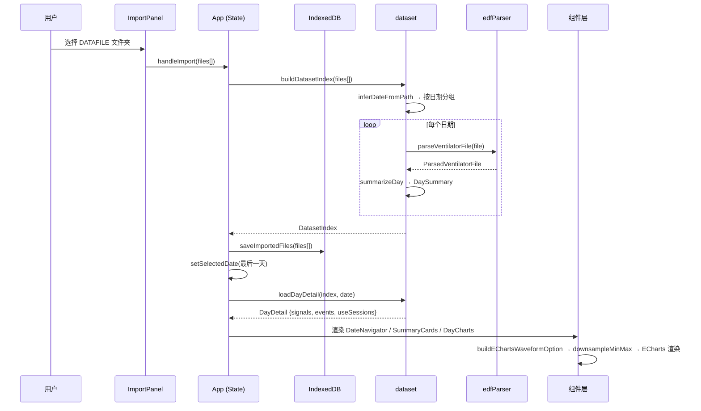

# 系统架构文档

## 架构总览

```mermaid
graph TD
    subgraph 用户交互
        IP[ImportPanel] -->|File API| IC[importCache]
        IP -->|files[]| APP
    end

    subgraph 数据层
        APP[App] -->|buildDatasetIndex| DS[dataset]
        DS -->|parseVentilatorFile| EDF[edfParser]
        DS -->|parseBa525ConfigRecords| BCFG[ba525ConfigParser]
    end

    subgraph 图表层
        DC[DayCharts] -->|values, sampleRate| WC[WaveformChart]
        WC -->|buildEChartsWaveformOption| EO[echartsWaveformOptions]
        EO -->|downsampleMinMax| DS_LIB[downsample]
    end

    subgraph 组件层
        APP --> DN[DateNavigator]
        APP --> SC[SummaryCards]
        APP --> DC
        APP --> RFB[RawFileBrowser]
        DC --> ET[EventTable]
    end

    IC[(IndexedDB 缓存)]
    APP -->|load/save| IC
```

## 完整数据流



## 模块职责与依赖

### parser/ — 二进制解码

| 模块 | 职责 |
|------|------|
| `edfParser` | 解析 EDF-like 呼吸机文件：512 字节固定头部 → 信号类型判定 → payload 解码（波形/事件/三元组/配置） |
| `ba525ConfigParser` | 解析 BA525 设备 192 字节配置记录：字段规格表驱动解码，支持 enum 映射、缩放、精度控制 |

**关键类型**（`types.ts`）：
- `ParsedVentilatorFile` — 解析结果容器，`kind` 字段区分 8 种数据类型
- `VentilatorHeader` — 512 字节头部结构化字段
- `EventRecord` / `TripleRecord` — 结构化事件/三元组记录

**依赖方向**：`parser` 不依赖任何上层模块，仅输出纯数据结构。

### data/ — 数据索引与缓存

| 模块 | 职责 |
|------|------|
| `dataset` | 按日期构建数据索引（`buildDatasetIndex`）、生成每日摘要（`DaySummary`）、按需加载详情（`loadDayDetail`） |
| `importCache` | 基于 IndexedDB 的文件持久化，支持跨会话恢复导入 |

`dataset` 核心流程：
1. `inferDateFromPath` 从文件路径提取日期（支持 `YYYYMMDD` 和 `YYYY-MM-DD`）
2. 按日期分组后并行解析全部文件
3. `summarizeDay` 汇总信号存在性、事件计数、压力范围、使用会话
4. `buildUseSessions` 从 `usetime` 事件记录构建使用时段

`DatasetIndex` 是贯穿应用的核心数据结构，包含按日期索引的全部摘要和已解析文件缓存。

### charts/ — 波形可视化

| 模块 | 职责 |
|------|------|
| `downsample` | Min-Max 降采样算法：将 N 个采样点压缩为 `pixelWidth` 个桶，每个桶保留 min/max 两个关键点 |
| `echartsWaveformOptions` | 构建 ECharts 配置：坐标轴、dataZoom、markLine 事件标记、时间轴映射 |
| `WaveformChart` | ECharts React 封装：实例管理、resize 响应、事件焦点定位（dataZoom 联动） |
| `waveformData` | 类型导出（`WaveformValues`） |

波形时间轴有三种模式：
- **会话时间**（`useSessions` 存在时）：按使用会话拼接，间隙插 null 断点
- **头部时间**（`startTime` + `sampleRateHz`）：线性时间映射
- **索引模式**（无时间信息）：x 轴为采样序号或秒数

### components/ — UI 组件

| 组件 | 职责 |
|------|------|
| `ImportPanel` | 文件选择入口，支持文件夹和单文件两种模式 |
| `DateNavigator` | 日期导航侧栏：跳转、前后翻页、热力图、缺失文件筛选 |
| `SummaryCards` | 当日摘要卡片：使用时长、AI/HI 计数、压力范围、缺失文件数 |
| `DayCharts` | 波形图表主面板：Tab 切换信号、事件标记、事件列表联动 |
| `EventTable` | 独立事件表格（含类型筛选和定位按钮） |
| `RawFileBrowser` | 原始文件浏览器：文件详情折叠面板、BA525 配置解析、CSV 导出 |

## importCache 设计

**动机**：浏览器环境下用户通过 `<input type="file">` 导入文件，页面刷新后 `File` 对象丢失，需要重新选择 DATAFILE 文件夹。这对包含大量日期数据的场景体验差。

**实现**：
- 使用 IndexedDB 存储 `File` 对象（序列化为 `ArrayBuffer` + 元数据）
- 批量写入（每批 20 个文件），首次写入时清空旧缓存
- key 为文件路径（`webkitRelativePath || name`），自动覆盖重复导入

**恢复流程**：App 初始化时 `useEffect` 调用 `loadImportedFiles()`，若存在缓存则直接 `buildDatasetIndex` 恢复状态，无需用户再次选择。

## 降采样策略

**算法**：`downsampleMinMax`（Min-Max 保留）

**触发条件**：当原始采样点数 > `pixelWidth * 2` 时触发。`pixelWidth` 取容器实际宽度（最小 320px），默认 1200。

**流程**：
1. 将可视区间等分为 `pixelWidth` 个桶
2. 每个桶扫描全部采样，记录最小值和最大值的索引
3. 按 min/max 索引顺序输出 1-2 个关键点（保留视觉特征）
4. 若桶内仅一个采样值，则额外保留桶尾值

**设计取舍**：Min-Max 策略在保持视觉极值特征的同时，确保每个像素桶的信息密度。ECharts 的 `sampling: 'lttb'` 作为二次采样补充。

## 状态管理

采用 **React useState + prop drilling** 模式，无 context 或外部状态库。

| 状态 | 位置 | 类型 |
|------|------|------|
| `dataset` (DatasetIndex) | App | `useState` |
| `selectedDate` | App | `useState` |
| `dayDetail` (DayDetail) | App | `useState` |
| `isIndexing` / `isLoadingDay` / `isRestoringImport` | App | `useState` |
| `error` / `cacheNotice` / `indexProgress` | App | `useState` |
| `selectedFileName` / `renderedFileName` | DayCharts | `useState` |
| `focusedIndex` | DayCharts | `useState` |
| `missingOnly` / `jumpDate` | DateNavigator | `useState` |
| `activeFilter` | EventTable | `useState` |

**数据流向**：App 持有全局状态，通过 props 向下传递。`DayCharts` 和 `DateNavigator` 分别管理各自的 UI 局部状态。`useEffect` 处理副作用（文件恢复、日期切换加载详情）。

`DayCharts` 使用 lazy import + `Suspense` 延迟加载，首次渲染不会阻塞主界面。
