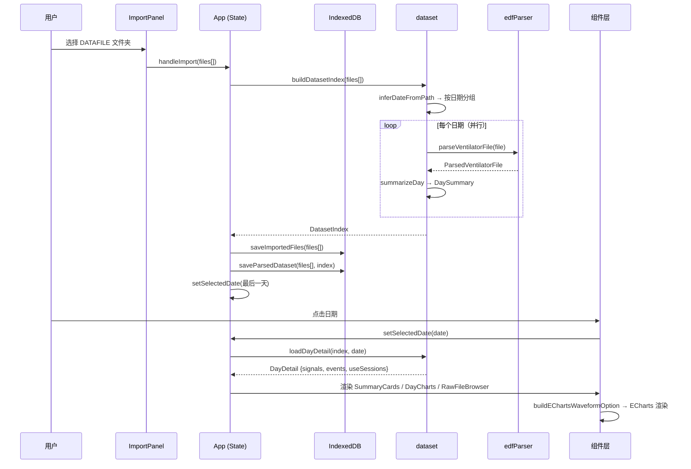

# 系统架构文档

## 架构总览

```mermaid
graph TD
    subgraph 用户交互
        IP[ImportPanel] -->|File API| IC[(importCache)]
        IP -->|files[]| APP[App]
    end

    subgraph 数据层
        APP -->|buildDatasetIndex| DS[dataset]
        DS -->|parseVentilatorFile| EDF[edfParser]
    end

    subgraph 缓存层
        APP -->|save/load| IC
        APP -->|save/load| PC[(parsedCache)]
    end

    subgraph 图表层
        DC[DayCharts] -->|values, sampleRate| WC[WaveformChart]
        WC -->|buildEChartsWaveformOption| EO[echartsWaveformOptions]
        EO -->|downsampleMinMax| DLIB[downsample]
    end

    subgraph 组件层
        APP --> DN[DateNavigator]
        APP --> SC[SummaryCards]
        APP --> DC
        APP --> RFB[RawFileBrowser]
        APP --> AI[AiAnalysisPanel]
        RFB -->|parseBa525ConfigRecords| BCFG[ba525ConfigParser]
    end
```

## 完整数据流



## 模块职责与依赖

### parser/ — 二进制解码

| 模块 | 职责 |
|------|------|
| `edfParser` | 解析 EDF-like 呼吸机文件：512 字节固定头部 → 信号类型判定 → payload 解码（波形/事件/三元组/配置） |
| `ba525ConfigParser` | 解析 BA525 设备 192 字节配置记录：字段规格表驱动解码，支持 enum 映射、缩放、精度控制 |

**关键类型**（`types.ts`）：
- `ParsedVentilatorFile` — 解析结果容器，`kind` 字段区分 8 种数据类型
- `VentilatorHeader` — 512 字节头部结构化字段
- `EventRecord` / `TripleRecord` — 结构化事件/三元组记录

**依赖方向**：`parser` 不依赖任何上层模块，仅输出纯数据结构。`edfParser` 被 `dataset.ts` 调用；`ba525ConfigParser` 被 `RawFileBrowser.tsx` 调用。

### data/ — 数据索引与缓存

| 模块 | 职责 |
|------|------|
| `dataset` | 按日期构建数据索引（`buildDatasetIndex`）、生成每日摘要（`DaySummary`）、按需加载详情（`loadDayDetail`） |
| `importCache` | 基于 IndexedDB 的原始文件持久化，存储 `File` 对象（序列化为 ArrayBuffer + 元数据） |
| `parsedCache` | 基于 IndexedDB 的解析结果持久化，通过 manifest 校验文件一致性，支持直接恢复（跳过原始文件读取） |
| `csv` | 波形/事件数据 CSV 导出，通过 Blob + `URL.createObjectURL` 触发浏览器下载 |

`dataset` 核心流程：
1. `inferDateFromPath` 从文件路径提取日期（支持 `YYYYMMDD` 和 `YYYY-MM-DD`）
2. 按日期分组后并行调用 `summarizeDay` 解析全部文件
3. `summarizeDay` 汇总信号存在性、事件计数、使用会话（跳过 pressure 全量扫描以加速索引）
4. `buildUseSessions` 从 `usetime` 事件记录构建使用时段（value1 = 秒数，timestamp = 结束时间）
5. `loadDayDetail` 按需加载完整日详情，延迟计算 pressure range

`DatasetIndex` 是贯穿应用的核心数据结构，包含按日期索引的全部摘要和已解析文件缓存。

### charts/ — 波形可视化

| 模块 | 职责 |
|------|------|
| `downsample` | Min-Max 降采样算法：将 N 个采样点压缩为 `pixelWidth` 个桶，每个桶保留 min/max 两个关键点 |
| `echartsWaveformOptions` | 构建 ECharts 配置：坐标轴、dataZoom、markLine 事件标记、时间轴映射 |
| `WaveformChart` | ECharts React 封装：实例管理、ResizeObserver 自适应、事件焦点定位（dataZoom 联动） |
| `waveformData` | 类型导出（`WaveformValues = Uint8Array \| Uint16Array \| Int16Array`） |

波形时间轴有三种模式：
- **会话时间**（`useSessions` 存在时）：按使用会话拼接，间隙插 null 断点
- **头部时间**（`startTime` + `sampleRateHz`）：线性时间映射
- **索引模式**（无时间信息）：x 轴为采样序号或秒数

### components/ — UI 组件

| 组件 | 职责 |
|------|------|
| `ImportPanel` | 文件选择入口，支持文件夹和单文件两种模式 |
| `DateNavigator` | 日期导航侧栏：跳转、前后翻页、热力图、缺失文件筛选 |
| `SummaryCards` | 当日摘要卡片：使用时长、AI/HI 计数、压力范围、缺失文件数 |
| `DayCharts` | 波形图表主面板：Tab 切换信号、事件标记、内嵌事件列表联动 |
| `EventTable` | 独立事件表格组件（含类型筛选和定位按钮，当前未在 App 中直接使用） |
| `RawFileBrowser` | 原始文件浏览器：文件详情折叠面板、BA525 配置解析、CSV 导出 |
| `AiAnalysisPanel` | AI 分析面板：支持 OpenAI/Anthropic 流式生成，缓存报告到 IndexedDB |

### ai/ — AI 分析

| 模块 | 职责 |
|------|------|
| `client` | 通用 SSE 流式 HTTP 客户端，适配 OpenAI/Anthropic API |
| `providers` | 构建不同 provider 的请求格式（OpenAI / Anthropic） |
| `dataSummary` | 将 `DaySummary` 转为文本摘要，构建系统 prompt |
| `settings` | AI 设置持久化（provider、endpoint、apiKey、model、自定义 prompt），存储于 localStorage |
| `reportCache` | 分析报告的 IndexedDB 缓存，以日期+provider+model+prompt 组合为 key |

## 缓存机制

### importCache（原始文件缓存）

- **IndexedDB**: `ventilator-web-visualizer-import-cache`，objectStore `files`，以文件 path 为 key
- **写入**: 批量写入，每批 20 个文件，首批写入前清空旧数据
- **序列化**: `File` → `{ path, name, type, lastModified, data: ArrayBuffer }`

### parsedCache（解析结果缓存）

- **IndexedDB**: `ventilator-parsed-cache`，objectStore `cache`
- **存储结构**:
  - `manifest` — 文件指纹列表（path + lastModified + size），用于校验一致性
  - `meta` — 日期列表、日期范围、每日摘要、警告
  - `parsed:YYYY-MM-DD` — 每日的 `ParsedVentilatorFile[]` 序列化结果
- **恢复优先级**:
  1. `loadParsedDatasetDirect()` — 直接从缓存恢复，不读取原始文件
  2. `loadParsedDataset(files)` — 需要原始文件引用，校验 manifest 一致性
  3. `buildDatasetIndex(files)` — 完全重新解析

**App 初始化恢复流程**：
1. 先尝试 `loadParsedDatasetDirect()` 直接恢复（最快路径）
2. 若失败，尝试 `loadImportedFiles()` → `loadParsedDataset(cachedFiles)` 匹配恢复
3. 若仍失败，用缓存原始文件 `buildDatasetIndex()` 重新解析
4. 全部失败则等待用户手动导入

## 降采样策略

**算法**：`downsampleMinMax`（Min-Max 保留）

**触发条件**：当原始采样点数 > `pixelWidth * 2` 时触发。`pixelWidth` 取容器实际宽度（最小 320px），默认 1200。

**流程**：
1. 将可视区间等分为 `pixelWidth` 个桶
2. 每个桶扫描全部采样，记录最小值和最大值的索引
3. 按 min/max 索引顺序输出 1-2 个关键点（保留视觉特征）
4. 若桶内仅一个采样值，则额外保留桶尾值

**设计取舍**：Min-Max 策略在保持视觉极值特征的同时，确保每个像素桶的信息密度。ECharts 的 `sampling: 'lttb'` 作为二次采样补充。

## 状态管理

采用 **React useState + prop drilling** 模式，无 context 或外部状态库。

| 状态 | 位置 | 类型 |
|------|------|------|
| `dataset` (DatasetIndex) | App | `useState` |
| `selectedDate` | App | `useState` |
| `dayDetail` (DayDetail) | App | `useState` |
| `isIndexing` / `isLoadingDay` / `isRestoringImport` | App | `useState` |
| `error` / `cacheNotice` / `indexProgress` | App | `useState` |
| `aiPanelOpen` | App | `useState` |
| `selectedFileName` / `renderedFileName` | DayCharts | `useState` |
| `focusedIndex` | DayCharts | `useState` |
| `missingOnly` / `jumpDate` | DateNavigator | `useState` |
| `activeFilter` | EventTable | `useState` |
| `settings` / `status` / `report` | AiAnalysisPanel | `useState` |

**数据流向**：App 持有全局状态，通过 props 向下传递。子组件管理各自的 UI 局部状态。`useEffect` 处理副作用（文件恢复、日期切换加载详情、AI 报告缓存加载）。

`DayCharts` 使用 lazy import + `Suspense` 延迟加载，首次渲染不会阻塞主界面。

## 技术栈

- **React 19** + **TypeScript** — UI 框架
- **Vite** — 构建工具
- **Tailwind CSS 4** — 样式
- **ECharts 6** — 图表渲染（按需引入：LineChart, CanvasRenderer, DataZoom, Grid, MarkLine, Toolbox, Tooltip）
- **HeroUI** — UI 组件库（Button, Card, Chip, Tabs）
- **react-markdown** + **remark-gfm** + **rehype-highlight** — AI 报告 Markdown 渲染
- **Vitest** + **Testing Library** — 测试
- 路径别名: `@` → `src/`
