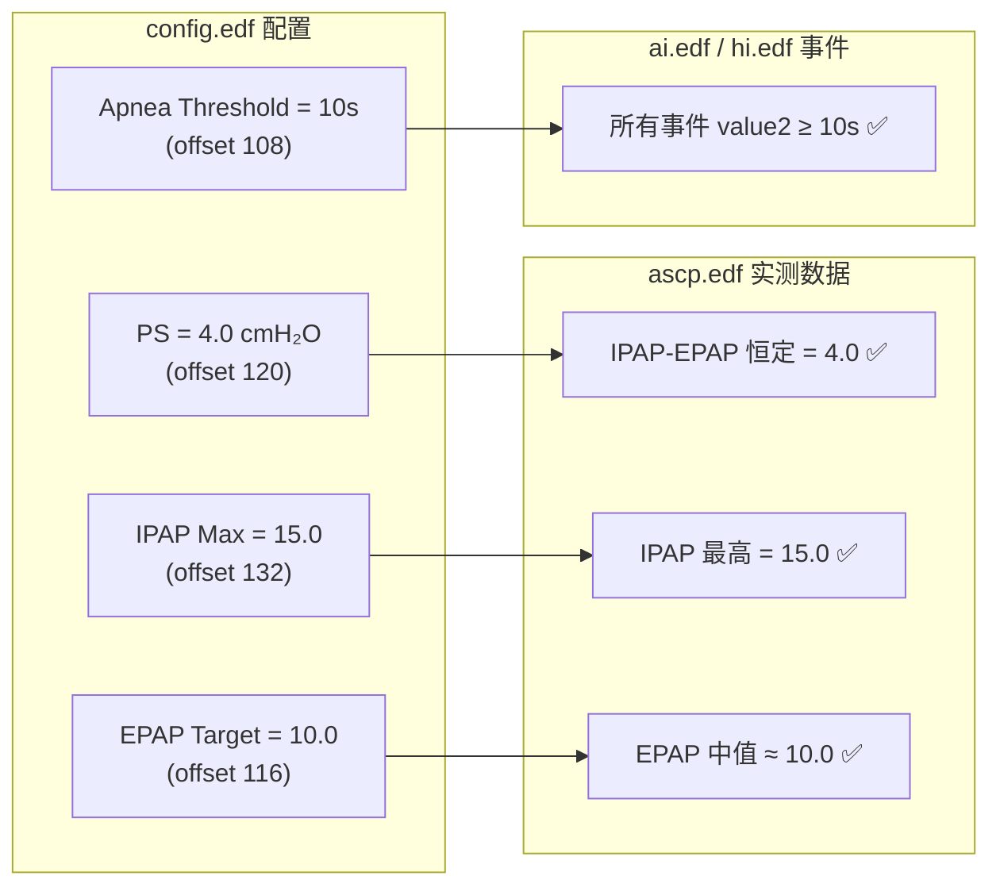

# config.edf 深度解析

## 总体结构

`config.edf` 的 payload 为 **400 字节**，包含 **2 个完全相同的配置快照**（每个 200 字节 = 192 字节配置 + 8 字节时间戳）。两个快照记录了治疗会话中两个时刻的设备配置参数。

```
config.edf (912 bytes total)
├── Header: 512 bytes (与其他 EDF 文件相同格式)
└── Payload: 400 bytes
    ├── Config Block 1: 200 bytes
    │   ├── 配置数据: 192 bytes
    │   └── 时间戳: 8 bytes → 2026-04-27 01:00:49.20 (会话开始)
    └── Config Block 2: 200 bytes
        ├── 配置数据: 192 bytes (与 Block 1 完全相同)
        └── 时间戳: 8 bytes → 2026-04-27 01:04:16.14 (会话中段)
```

> [!IMPORTANT]
> 跨 3 天（0427/0428/0429）的 config.edf 对比显示：**只有时间戳不同，所有配置参数完全一致**。这证明是同一台设备、同一套配置。

---

## 配置块内部结构（192 字节）

整个 192 字节分为 5 个区域：

```
偏移         区域              长度    数据类型
─────────────────────────────────────────────────
[0-39]      设备/模式参数        40B    Uint8/Uint16LE 混合
[40-67]     压力统计/校准值      28B    Float32LE × 7
[68-95]     保留区域(全零)       28B    —
[96-111]    功能开关/枚举设置    16B    Uint8 × 16
[112-167]   治疗压力参数         56B    Float32LE × 14
[168-191]   附加参数             24B    Uint8 混合
```

---

## 区域 1：设备/模式参数（偏移 0-39）

| 偏移 | 类型 | 值 | 推测含义 |
|------|------|------|---------|
| 0 | Uint16LE | **204** (0xCC) | 配置记录有效长度标记 |
| 2 | Uint16LE | **512** (0x200) | Header 大小引用 |
| 4 | Uint16LE | 0 | 保留 |
| 6 | Uint16LE | **256** (0x100) | 配置版本/标志位 |
| 8 | Uint16LE | **1** | 启用标记 |
| 10-14 | 3×Uint16LE | 0, 0, 0 | 保留 |
| 16 | Uint16LE | **250** | 🔑 设备最大压力能力 = **25.0 cmH₂O** |
| 18 | Uint16LE | 1 | — |
| 20 | Uint16LE | 256 | — |
| 22-26 | 3×Uint16LE | 0, 0, 0 | 保留 |
| 28 | Uint16LE | **19** | 未确定（可能是固件子版本?） |
| 30 | Uint16LE | 0 | — |
| 32 | Uint16LE | **2** | 🔑 治疗模式（2 = BiPAP/双水平?） |
| 34 | Uint16LE | **14** | 可能的参数配置 |
| 36 | Uint16LE | **13** | 可能的参数配置 |
| 38 | Uint16LE | 0 | — |

---

## 区域 2：压力统计/校准值（偏移 40-67）

这 7 个 Float32LE 值不是整数，带有小数位，很可能是 **设备测量/计算出的统计值** 或 **出厂校准参数**：

| 偏移 | Float32 值 | 推测含义 |
|------|-----------|---------|
| 40 | **18.5000** | 最高压力记录值 (cmH₂O) |
| 44 | **9.5000** | 最低 EPAP 记录值 (cmH₂O) |
| 48 | **2.0320** | 标准差 / 漏气量参数 |
| 52 | **18.6000** | 压力峰值/百分位值 (cmH₂O) |
| 56 | **10.3000** | 平均 EPAP / 压力统计 |
| 60 | **8.3000** | 压力变化范围 |
| 64 | **0.0321** | 传感器校准系数（极小值） |

> [!NOTE]
> 这些值跨天不变且有小数位，更可能是设备出厂时写入的 **传感器校准参数**，而不是每次治疗的统计结果。

---

## 区域 3：功能开关/枚举设置（偏移 96-111）

16 个 Uint8 值，都是小整数（0-20），典型的 **设备功能菜单设置**：

| 偏移 | 值 | 推测含义 |
|------|------|---------|
| 96 | **3** | 🔑 治疗模式（3 = ASV 自适应伺服通气？） |
| 97 | **0** | 子模式变体 |
| 98 | **1** | EPR（呼气压力释放）开关：1 = 开启 |
| 99 | **20** | 🔑 渐升时间 (Ramp Time) = **20 分钟** |
| 100 | **2** | EPR 等级 (1-3档)：2档 |
| 101 | **2** | 加湿器档位 (0-5)：2档 |
| 102 | **0** | 面罩类型 (0=鼻罩? 1=口鼻? 2=鼻枕?) |
| 103 | **3** | 响应灵敏度 (1-3)：最高 |
| 104 | **1** | 自动开机 (Auto-Start)：1=开启 |
| 105 | **2** | 智能启停模式 |
| 106 | **3** | 功能标志 |
| 107 | **1** | 功能标志 |
| 108 | **10** | 🔑 呼吸暂停判定阈值 = **10 秒**（与 AI 数据吻合！） |
| 109 | **3** | 检测灵敏度等级 |
| 110 | **20** | 低通气判定参数（20 = 20%? 20秒?） |
| 111 | **3** | 检测等级 |

> [!IMPORTANT]
> **偏移 108 的值 = 10** 与 AI/HI 事件中 value2 全部 ≥ 10 秒完美匹配——这就是设备用来判定"呼吸暂停"的 **最短持续时间阈值**！

---

## 区域 4：治疗压力参数（偏移 112-167）

14 个 Float32LE 值，全是 **整数值**（如 4.0, 8.0, 10.0, 15.0），这是医生处方的 **治疗压力配置**：

| 偏移 | 值 (cmH₂O) | 推测含义 | ASCP 数据验证 |
|------|------------|---------|-------------|
| 112 | **8.0** | EPAP 最小值 | — |
| 116 | **10.0** | EPAP 目标/默认值 | ASCP EPAP 范围 9.1-11.0 ✅ |
| 120 | **4.0** | 🔑 **压力支持 (PS)** | ASCP PS 恒定 = 4.0 ✅ |
| 124 | **10.0** | EPAP 最大值 | ASCP EPAP max = 11.0 ≈ ✅ |
| 128 | **4.0** | PS 最小值 | — |
| 132 | **15.0** | 🔑 **IPAP 最大值** | ASCP IPAP max = 15.0 ✅ |
| 136 | **9.0** | EPAP 启动/初始值 | — |
| 140 | **4.0** | PS 相关设置 | — |
| 144 | **4.0** | PS 相关设置 | — |
| 148 | **10.0** | 压力参数 | — |
| 152 | **4.0** | PS 相关设置 | — |
| 156 | **10.0** | 压力参数 | — |
| 160 | **4.0** | PS 相关设置 | — |
| 164 | **3.0** | 🔑 渐升起始压力 (Ramp Start) = **3.0 cmH₂O** | — |

> [!TIP]
> **三重验证通过：**
> - `float[120] = 4.0` → ASCP 中 IPAP-EPAP 始终 = 4.0 ✅
> - `float[132] = 15.0` → ASCP 中 IPAP 最高 = 15.0 ✅
> - `byte[191] = 150` → ASCP 中 IPAP×10 最高 = 150 ✅

---

## 区域 5：附加参数（偏移 168-191）

| 偏移 | 值 | 推测含义 |
|------|------|---------|
| 168 | **5** | 渐升类型 (5=自动?) |
| 169 | **60** | 最大治疗时长 = 60 (分钟?) 或告警阈值 |
| 170-181 | 0 | 保留（全零） |
| 182 | **20** | 渐升时间（与偏移 99 一致）= 20 分钟 |
| 184 | **2** | EPR 等级（与偏移 100 一致）= 2 |
| 185 | **12** | 参数值 |
| 186 | **77** (0x4D) | 标志值 / 告警代码 |
| 187-190 | 0 | 保留 |
| 191 | **150** (0x96) | 🔑 IPAP 最大值 × 10 = **15.0 cmH₂O** |

---

## Node.js 解析代码

```javascript
const fs = require('fs');

const HEADER_BYTES = 512;
const CONFIG_BLOCK_SIZE = 200; // 192 data + 8 timestamp

function parseTimestamp(buf, offset) {
  const year = buf.readUInt16LE(offset);
  const month = buf[offset + 2];
  const day = buf[offset + 3];
  const hour = buf[offset + 4];
  const minute = buf[offset + 5];
  const second = buf[offset + 6];
  const centisecond = buf[offset + 7];
  
  if (year < 1900 || year > 2200) return null;
  return `${year}-${String(month).padStart(2,'0')}-${String(day).padStart(2,'0')} ` +
         `${String(hour).padStart(2,'0')}:${String(minute).padStart(2,'0')}:` +
         `${String(second).padStart(2,'0')}.${String(centisecond).padStart(2,'0')}`;
}

function parseConfigBlock(buf, blockOffset) {
  return {
    // 设备参数
    recordSize:     buf.readUInt16LE(blockOffset + 0),    // 204
    headerRef:      buf.readUInt16LE(blockOffset + 2),    // 512
    configFlags:    buf.readUInt16LE(blockOffset + 6),    // 256
    maxDevicePressure: buf.readUInt16LE(blockOffset + 16) / 10.0,  // 25.0 cmH₂O
    therapyMode:    buf.readUInt16LE(blockOffset + 32),   // 2 = BiPAP?
    
    // 校准/统计值 (Float32)
    calibration: {
      pressurePeak:   buf.readFloatLE(blockOffset + 40),  // 18.5
      pressureMin:    buf.readFloatLE(blockOffset + 44),  // 9.5
      stdDeviation:   buf.readFloatLE(blockOffset + 48),  // 2.032
      pressure95th:   buf.readFloatLE(blockOffset + 52),  // 18.6
      pressureMean:   buf.readFloatLE(blockOffset + 56),  // 10.3
      pressureRange:  buf.readFloatLE(blockOffset + 60),  // 8.3
      sensorCoeff:    buf.readFloatLE(blockOffset + 64),  // 0.0321
    },
    
    // 功能设置 (Uint8)
    settings: {
      mode:           buf[blockOffset + 96],   // 3 = ASV?
      subMode:        buf[blockOffset + 97],   // 0
      eprEnabled:     buf[blockOffset + 98],   // 1 = on
      rampTime:       buf[blockOffset + 99],   // 20 minutes
      eprLevel:       buf[blockOffset + 100],  // 2
      humidifierLevel:buf[blockOffset + 101],  // 2
      maskType:       buf[blockOffset + 102],  // 0 = nasal
      sensitivity:    buf[blockOffset + 103],  // 3 = high
      autoStart:      buf[blockOffset + 104],  // 1 = on
      smartStart:     buf[blockOffset + 105],  // 2
      apneaThreshold: buf[blockOffset + 108],  // 10 seconds
    },
    
    // 治疗压力配置 (Float32, cmH₂O)
    pressureConfig: {
      epapMin:        buf.readFloatLE(blockOffset + 112),  // 8.0
      epapTarget:     buf.readFloatLE(blockOffset + 116),  // 10.0
      pressureSupport:buf.readFloatLE(blockOffset + 120),  // 4.0
      epapMax:        buf.readFloatLE(blockOffset + 124),  // 10.0
      psMin:          buf.readFloatLE(blockOffset + 128),  // 4.0
      ipapMax:        buf.readFloatLE(blockOffset + 132),  // 15.0
      epapStart:      buf.readFloatLE(blockOffset + 136),  // 9.0
      rampStartPressure: buf.readFloatLE(blockOffset + 164), // 3.0
    },
    
    // 附加参数
    extra: {
      rampType:         buf[blockOffset + 168],  // 5
      maxDurationOrAlarm: buf[blockOffset + 169], // 60
      rampTimeBackup:   buf[blockOffset + 182],  // 20
      eprLevelBackup:   buf[blockOffset + 184],  // 2
      ipapMaxX10:       buf[blockOffset + 191],  // 150 → 15.0
    },
    
    // 时间戳
    timestamp: parseTimestamp(buf, blockOffset + 192),
  };
}

function parseConfigFile(filePath) {
  const buf = fs.readFileSync(filePath);
  const payload = buf.slice(HEADER_BYTES);
  
  const blocks = [];
  for (let i = 0; i + CONFIG_BLOCK_SIZE <= payload.length; i += CONFIG_BLOCK_SIZE) {
    blocks.push(parseConfigBlock(payload, i));
  }
  
  return {
    blockCount: blocks.length,
    blocks,
    // 便捷访问：取第一个 block 作为主配置
    config: blocks[0] || null,
  };
}

// 使用
const result = parseConfigFile('./20260427_config.edf');
console.log(JSON.stringify(result, null, 2));
```

---

## 配置参数与实际数据的交叉验证



> [!TIP]
> 配置中最有临床价值的参数是 **治疗压力配置**（区域 4），这些参数直接决定了 ASCP 的输出行为。如果需要在应用中展示"处方设置"，重点解析偏移 112-167 的 14 个 Float32 值即可。
